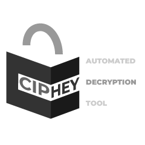

# ciphey

<p align="center">
  
</p>

`ciphey` is an automated decoding and cracking tool written in Rust. Give it
encoded text and it searches through decoder chains until a checker identifies
likely plaintext.

This repository is library-first. The CLI is intentionally thin: it parses
arguments and config, then calls `ciphey::perform_cracking()` to run storage,
plaintext checking, and the search pipeline.

## Install

From crates.io:

```sh
cargo install ciphey
```

From a local checkout:

```sh
git clone https://github.com/bee-san/ciphey
cd ciphey
cargo install --path .
```

For development, you can run the binary directly:

```sh
cargo run -- --text "SGVsbG8sIFdvcmxkIQ=="
```

Docker is also supported:

```sh
docker build -t ciphey .
docker run --rm ciphey --text "SGVsbG8sIFdvcmxkIQ=="
```

## CLI Usage

The current CLI expects input through `--text` or `--file`; positional input is
not accepted.

```sh
ciphey --text "SGVsbG8sIFdvcmxkIQ=="
ciphey --file encoded.txt
ciphey --text "..." --cracking-timeout 10
ciphey --text "..." --regex 'flag\{.*\}'
ciphey --text "..." --wordlist words.txt
ciphey --text "..." --top-results
ciphey --text "..." --disable-human-checker
ciphey --help
```

| Flag | Purpose |
| --- | --- |
| `-t`, `--text <TEXT>` | Decode text from the command line. |
| `-f`, `--file <FILE>` | Read encoded text from a file instead of `--text`. |
| `-c`, `--cracking-timeout <SECONDS>` | Stop searching after a timeout. The default is 5 seconds. |
| `-r`, `--regex <REGEX>` | Treat a regex or crib as the plaintext success condition. |
| `--wordlist <WORDLIST>` | Load newline-separated words for exact-match plaintext detection. |
| `--top-results` | Collect potential plaintexts until timeout instead of stopping at the first match. This disables the human checker. |
| `-d`, `--disable-human-checker` | Disable interactive confirmation prompts. Useful for scripts and APIs. |
| `-a`, `--api-mode <true\|false>` | Run in API mode. |
| `-v`, `--verbose...` | Increase logging verbosity. Repeat for more detail. |
| `--enable-enhanced-detection` | Enable the optional BERT-based plaintext detector. |

On first CLI run, ciphey creates `~/.ciphey/config.toml` and may ask a few setup
questions. CLI flags override values loaded from the config file.

## Library Usage

Add ciphey to your project:

```toml
[dependencies]
ciphey = "0.12"
```

Call the library entry point:

```rust
use ciphey::config::Config;
use ciphey::perform_cracking;

fn main() {
    let mut config = Config::default();
    config.timeout = 5;
    config.human_checker_on = false;

    match perform_cracking("SGVsbG8sIFdvcmxkIQ==", config) {
        Some(result) => {
            println!("{}", result.text.last().expect("decoded text"));

            let path = result
                .path
                .iter()
                .map(|step| step.decoder)
                .collect::<Vec<_>>()
                .join(" -> ");
            println!("path: {path}");
        }
        None => eprintln!("failed to decode input"),
    }
}
```

## What ciphey Tries

The search pipeline currently includes these decoder families:

- Base encodings: Base32, Base58 Bitcoin, Base58 Flickr, Base58 Monero,
  Base58 Ripple, Base64, Base91, Base65536, Z85.
- Text and byte transforms: A1Z26, binary, Braille, hexadecimal, Morse code,
  reverse text, URL encoding.
- Classical ciphers: Atbash, Caesar, Railfence, ROT47, simple substitution,
  Vigenere.
- Other formats: Brainfuck and Citrix Ctx1.

Plaintext detection is handled by checkers for English/gibberish, regex cribs,
wordlists, known token patterns through LemmeKnow, common passwords, optional
human confirmation, and optional enhanced detection through `gibberish-or-not`.

## Local State

ciphey stores user-local state under `~/.ciphey`:

- `~/.ciphey/config.toml` stores CLI defaults and preferences.
- `~/.ciphey/database.sqlite` stores the SQLite cache and related persistence.
- `~/.ciphey/models/` stores optional enhanced-detection model files.

Tests that touch the database should use `TestDatabase` and `set_test_db_path()`
from `src/lib.rs` instead of the default user database.

## Development

Use the same commands as CI and the repo tooling:

```sh
cargo check
cargo test
cargo nextest run
cargo clippy
cargo fmt --all
docker build .
```

The `justfile` provides shortcuts:

```sh
just test
just test-all
just build-all
```

Prefer the smallest relevant validation first, then broader checks before
shipping changes.

## Project Map

- `src/main.rs`: CLI binary entry point.
- `src/cli/`: CLI parsing, config merging, and first-run setup.
- `src/lib.rs`: public library entry point and orchestration.
- `src/decoders/`: decoder implementations and decoder registry.
- `src/searchers/`: search strategies.
- `src/checkers/`: plaintext detection and validation.
- `src/storage/`: SQLite-backed cache and persistence.
- `tests/`: integration and corpus tests.
- `docs/`: design notes and longer-form documentation.

Useful docs:

- [Architecture](docs/ares_architecture.md)
- [Overview](docs/ares_overview.md)
- [Plaintext identification](docs/plaintext_identification.md)
- [Storage](docs/storage.md)
- [Threat model](docs/threat_model.md)
- [Package manager notes](docs/package-managers.md)

## Adding Decoders

When adding a decoder, make it discoverable everywhere the pipeline expects it:

1. Add the implementation in `src/decoders/`.
2. Export and register it in `src/decoders/mod.rs`.
3. Add it to `src/filtration_system/mod.rs` so search can run it.
4. Add focused tests near the decoder or in `tests/`.

The decoder interface lives in `src/decoders/interface.rs`.

## License

ciphey is licensed under the MIT license.
